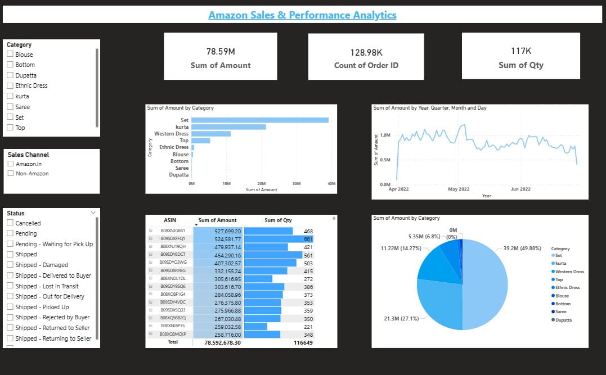

Amazon Sales & Performance Analytics Dashboard

📊 Project Overview:

This repository contains an interactive Power BI dashboard built from Amazon sales data. It highlights key performance indicators (KPIs), category breakdowns, time-based sales trends, and ASIN-level insights to support data-driven decision-making.

🚀 Features:

KPIs at a glance: Total revenue, order volume, and product quantities.

Category analysis: Bar and pie charts showing sales distribution across product categories.

Time trends: Line chart tracking sales performance over months.

ASIN-level detail: Table of top-performing products with revenue and quantity metrics.

Interactive filters: Category, sales channel, and status slicers for dynamic exploration.

📂 Dataset:

Source: Amazon sales report (sample dataset).

Fields include: Order ID, ASIN, Category, Quantity, Amount, Date, Sales Channel, Status.

Note: Sensitive or proprietary data has been excluded.

📸 Dashboard Overview

